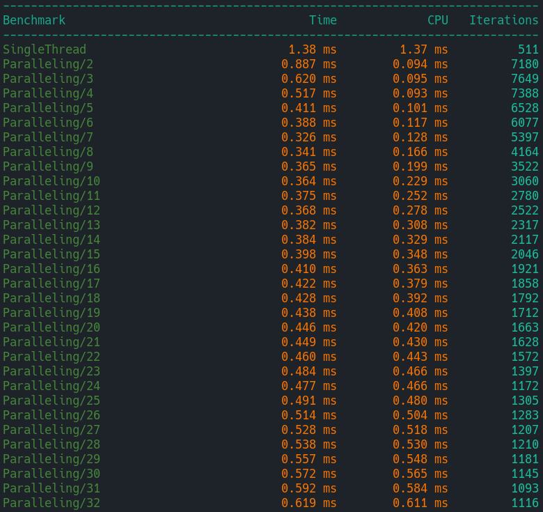

# Typo corrector

## What is it?

Typo corrector can correct typos in the file you give him.
Typo corrector can work in two modes -- text-based training, correction of typos in a file.

## How it works?

To begin with, the dictionary is trained on the texts that you give it. After that, this program can correct your typos in the file. Correction is carried out by searching in the dictionary and calculating the Levenshtein distance.

## Usage

Currently this project is can be compiled by g++ for Linux.

To use you need to download the folder with the code. Then go to the Typo_corrector folder and enter the following commands:
    
    mkdir build
    cd build
    cmake .. -DCMAKE_BUILD_TYPE=Release
    make

If you want to build with all possible targets you may build cmake like that:

    cmake .. -DADD_SANITIZERS=ON -DADD_CLANG_TIDY=ON -DADD_TYPO_CORRECTOR_TESTING=ON -DADD_BENCH=ON -DCMAKE_BUILD_TYPE=Release

## Speed of correction
In the code I use threads to understand at what number of threads does my program work optimally. So I used google benchmarks to find out this.

